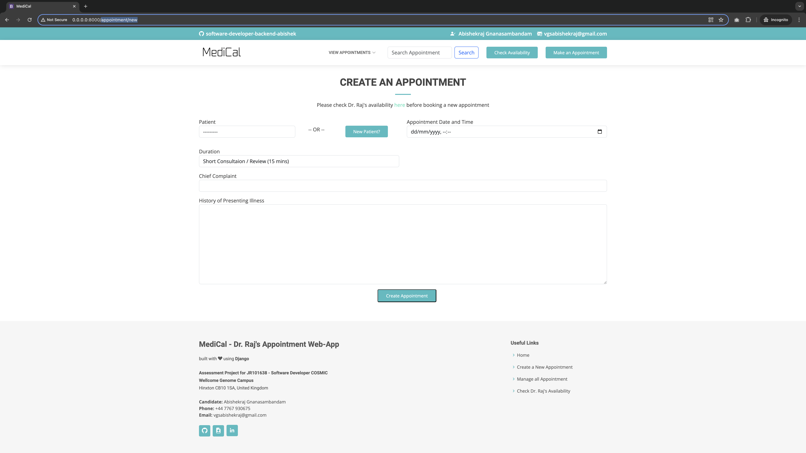

# How to Navigate MediCal (Detailed Walkthrough)

### 1. Homepage

I’ve made the homepage as simple yet useful as possible. 

Starting with the NavBar, we bring 

- Make an Appointment,
- Search for a specific appointment (Unique COSMC ID), and
- View or Manage Appointments.

Then, we have the landing page below that hosts three key features (as carousels) that I believe would be the most used by Dr. Raj’s Surgery staff. 

- View Appointments (Today’s)
- Manage Appointments (CRUD)
- Check the Availability of Dr. Raj

Finally, if we scroll down, the homepage displays all ongoing active appointments for the day for easy access (with the option to manage them right there on the home page)

### 2. “Make an Appointment” API:

url: appointment/new

The “new-appointment” api is obviously the star feature of this app. On the backend, I’ve used two models: Appointment and Patient to track every appointment. I’ve also added a feature where the staff can choose between adding a new used right here in the new appointments interface or choosing from one already registered. 

The new patient registration form is seamlessly integrated with the new appointment webpage so the user does not have to do two registrations separately . 

Once a patient is created, I’ve automatically make it resolve to a new url which passes the new patient id as primary key <int:pk> which helps the corresponding patient is pre-selected and the appointment process to take off from where we had left. 

There is also a quick link to the “check-availability” api if any user wanted to verify availability before confirming a new appointment. Post creation of any appointment, we then redirect to the “appointment-detail” API which will display every detail of an appointment including uniquely generated COSMC id. The staff can communicate this ID to any patient booking over phone to later pull their appointment details using the search API

Also the “new-appointment” API has a failsafe which prevents users from accidentally booking overlapping appointments. The webapp redirects to a 404 page with appropriate warning and a way to navigate back to the homepage:

### 3. “Search” API

Like I mentioned, It’s pretty straight forward. We can look up the Unique COSMC ID of any appointment to get back its appointment-details page again. 

We have two possible error scenarios: Either the ID is of an Invalid format or the request ID is deleted. In these cases I’ve displayed 404 page with an option to redirect to the homepage.

### 4. “View all appointments” API

This page brings the fulcrum of our CRUD operations. It displays the list of all appointments with easy EDIT and DELETE APIs, each appointment’s “appointment-details” API all right there within a card interface. 

We then can manage each of these appointments through the Edit and Delete API’s which are straight forward. 

### 5. Edit API

The Edit API also has the same appointment clashing failsafe which will prevent edited time slots to from overlapping with existing appointments

### 6. Delete API

---

## Back to the landing page.

The landing page below hosts three key features (as carousels) that I believe would be the most used by Dr. Raj’s Surgery staff. 

- View Appointments (Today’s) - just filters out today’s appointments but basically same as all appointments API
- Manage Appointments (CRUD) - all appointments API
- Check Availability of Dr. Raj  - “check-availability” API

### 7. Check Availability API:

By default the API shows today’s availability with Dr. Raj for an appointment.

It also has a Date selector which allows us to find Dr. Raj’s availability in any time in the future

And it also has a handy way to jump back to booking an appointment after checking the doctor’s availability.
